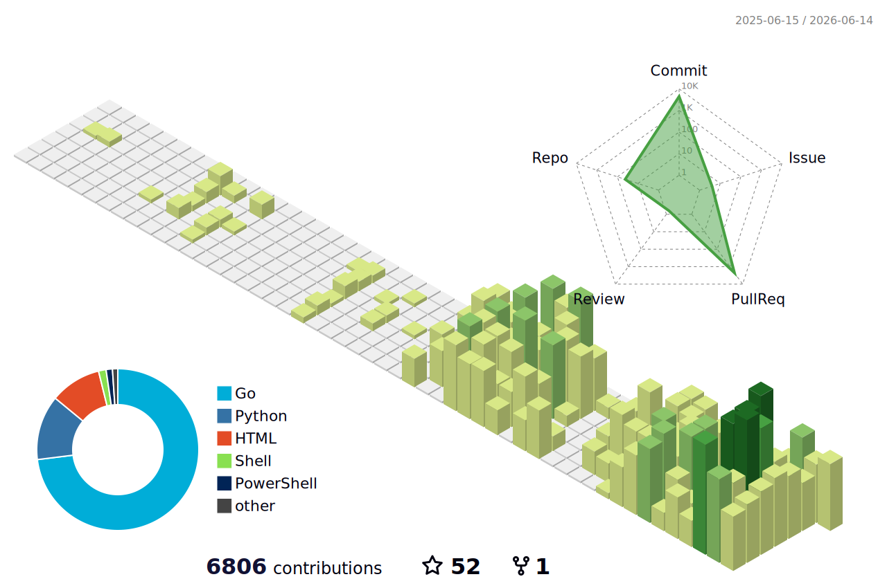

# PROFILE_README.md

This is a premium, modern, and animated template for your GitHub Profile README. To display this on your GitHub profile:
1. Create a public repository named exactly after your username (e.g., `arumes31`).
2. Add a `README.md` file in the root of that repository.
3. Copy and paste the Markdown content below into it.

---

```markdown
# Hi there, I'm Daniel (arumes31) 👋

<p align="center">
  
</p>

<p align="center">
  <a href="https://github.com/arumes31">
    
  </a>
  <a href="https://github.com/arumes31">
    
  </a>
</p>

---

## 🏆 GitHub Trophies

<p align="center">
  <a href="https://github.com/ryo-ma/github-profile-trophy">
    
  </a>
</p>

---

## 🛠️ Technology Stack & Skills

<p align="center">
  <!-- Languages -->
  
  
  
  
  
  <br/>
  
  <!-- DevOps & Tools -->
  
  
  
  
</p>

## 📊 Contribtuon Calendar

<p align="center">
  
</p>

---

## 📈 Performance & Statistics

<p align="center">
  <a href="https://github.com/anuraghazra/github-readme-stats">
    
  </a>
  &nbsp;&nbsp;&nbsp;&nbsp;
  <a href="https://github.com/anuraghazra/github-readme-stats">
    
  </a>
</p>

<p align="center">
  <a href="https://github.com/Ashutosh00710/github-readme-activity-graph">
    
  </a>
</p>

---

## 🚀 Recent Contributions & Projects

- 🛡️ **[blocklist](https://github.com/arumes31/blocklist)**: Hardened Go-based IP Blocklist manager with GeoIP & real-time WebSocket dashboard.
- 🌐 **[ye3ipsec-wan](https://github.com/arumes31/ye3ipsec-wan)**: Modernized IPSec Site-to-Site & Remote Access gateway based on strongSwan.
- ⚙️ **[servworx](https://github.com/arumes31/servworx)**: Lightweight self-healing Docker container monitor & automatic restarter.
- 🔐 **[rauth](https://github.com/arumes31/rauth)**: Authentication proxy and user identity gateway featuring WebAuthn (Passkeys).

---

<p align="center">
  
</p>
```
